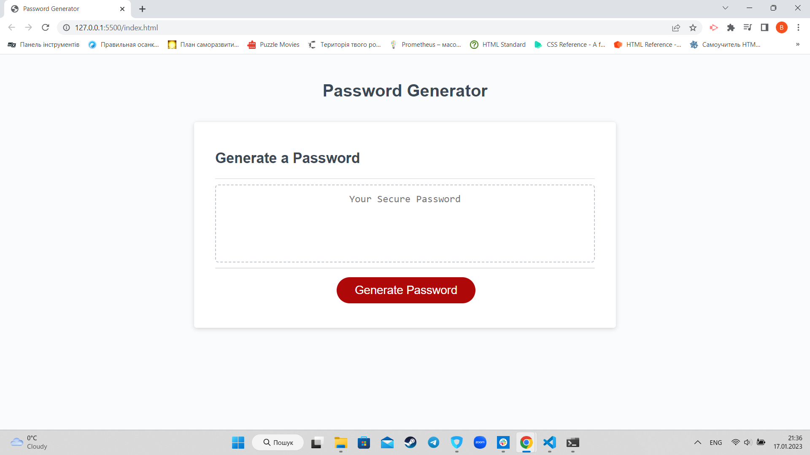
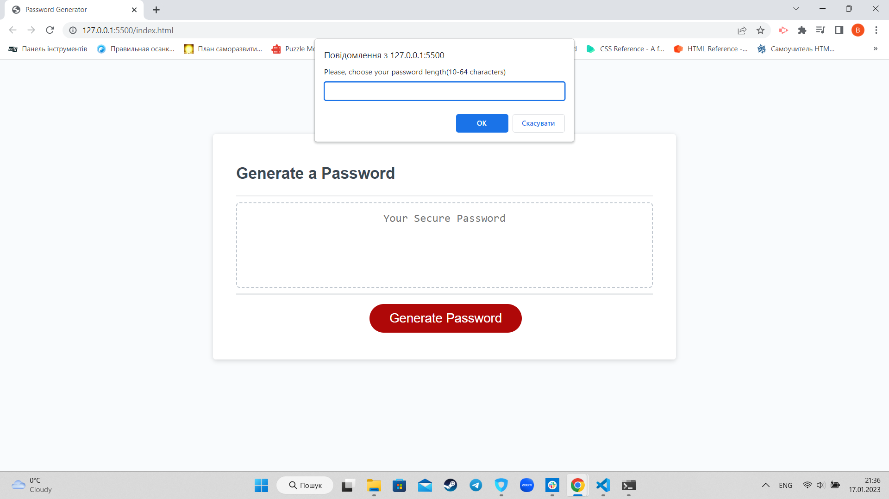

# Password-Generator

## Description
This project's taks was to create a random password generator. 
Using this password generator user can choose:
- The length of password;
- Include lower case letters;
- Include upper case letters;
- Include numbers;
- Include special characters.

## Installation

N/A

## Usage

In order to see the password generator follow the link. In order to create a password click on "Generate Password" button. Than follow the instructions.
https://hllmtrxwrld.github.io/Password-Generator/

## Credits

N/A

## License

N/A